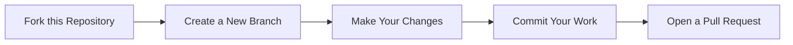

# 🎉 Hacktoberfest 2025 — Let’s Build Something Awesome Together!


<div align="center">

[](https://github.com/Open-Source-you/Hacktoberfest2025)  
  
  
<a href="https://github.com/Open-Source-you"></a>

</div>

---

### 🌱 Welcome to Hacktoberfest 2025!

This repository is created to help **new contributors** make their first successful step into the open-source world.  
Whether you’re a beginner, student, or hobbyist — Hacktoberfest is your perfect chance to learn, share, and grow with developers across the globe. 🌍

> 💡 “Every pull request tells a story — your story of learning, collaboration, and creativity.”

---

## 🌍 What Is Hacktoberfest?

Hacktoberfest is a **month-long open-source celebration** happening every October (1st–31st).  
It’s powered by [DigitalOcean](https://hacktoberfest.digitalocean.com/), in collaboration with [DEV Community](https://dev.to/) and [GitHub](https://github.com/).

By joining, you can:
- Make **4 quality pull requests** to any public GitHub repository.  
- Become part of the **global open-source community**.  

📍 Register here: [https://hacktoberfest.digitalocean.com/](https://hacktoberfest.digitalocean.com/)

---

## 🧭 How to Get Started

Here’s a step-by-step guide to make your first contribution:  




1️⃣ Star the Repository

Click the ⭐ Star button at the top right of this page.
It helps others discover this project and shows your support for open-source contributors like you!

2️⃣ Fork the Repo

Click Fork on the top-right of this page.
This creates a copy of the repository under your own GitHub account.

3️⃣ Clone Your Fork

Now, bring the project to your local machine:
```bash
git clone https://github.com/<your-username>/Hacktoberfest-2025.git
cd Hacktoberfest-2025
```

4️⃣ Set Up Remotes

Check that your local repository points to your fork:
```bash
git remote -v
```
Then, connect it to the original repo so you can stay updated:
```bash
git remote add upstream https://github.com/Open-Source-you/Hacktoberfest-2025.git
```
5️⃣ Stay Synced

Before making any changes, always keep your local copy updated:
```bash
git fetch --all --prune
git checkout main
git reset --hard upstream/main
git push origin main
```
This ensures you’re always working with the latest version of the project.

6️⃣ Create a New Branch

Avoid editing directly on the main branch.
Instead, create a new branch for your changes:
```bash
git checkout -b your-branch-name
```
7️⃣ Make Your Changes & Commit

Now, make your contribution — add code, fix bugs, improve docs, or add your name to a list!
Then commit your work:

```bash
git add .
git commit -m "Added my first open source contribution 🚀"
```
8️⃣ Push & Open a Pull Request

Push your branch to your forked repository:
```bash
git push -u origin your-branch-name
```
Then open your GitHub repo → click “Compare & Pull Request”,
add a meaningful title and short description — and hit Create Pull Request. 🎉

💬 Contribution Guidelines

We welcome and appreciate all kinds of contributions — including:

💻 Code improvements or bug fixes

🌐 Translations & documentation updates

📘 Tutorials, articles, or beginner guides

💡 New ideas or suggestions via Issues

If you want to propose something big, please open an issue first to discuss it with us.
Let’s make this space collaborative, inclusive, and welcoming for everyone! 🤝

🧡 Why Contribute?

Because open-source isn’t just about code — it’s about community, curiosity, and creativity.
You’ll gain real-world experience, meet developers from around the world, and grow as a creator.

“Contributing to open source is like leaving footprints in the digital universe — small steps that shape the future.”
🥳 Let’s Celebrate Open Source Together!

This October, let’s make something meaningful, together.
Whether it’s your first PR or your hundredth — we’re cheering you on! 🎊

🌟 Keep learning. Keep building. Keep sharing.
You’re officially part of the open-source movement now.

✨ Happy Hacking & Happy Hacktoberfest 2025! ✨
💬 Questions or suggestions? Open an issue — we’d love to hear from you. 🙌
🖤 Made with passion for the open-source community.

Example:
```bash
git checkout -b add-my-profile
```
## Help Contributing Guides :crown:

We love to have `articles` and `codes` in different languages and the `betterment` of existing ones.
Please discuss it with us first by creating a new issue.
